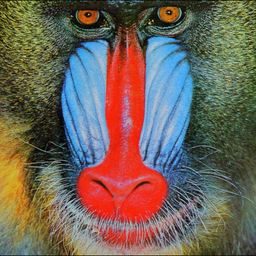
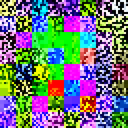
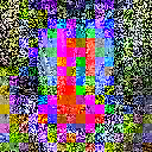
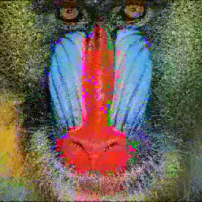
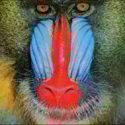

## Fractal compression

Fractal compression is the algorithm of lossy compression that uses properties of contraction mappings and fancy math behind it in order to replace image data (for example, pixel representation of a data) by a huge function, which can generate image on which it was 'learned' from any other image, thanks to math and convergence properties.

See more about Fractal compression [here](https://en.wikipedia.org/wiki/Fractal_compression).

| Image | Iteration |
|:--------------|:----------|
||None (original image) |
| | 1 |
| | 2 |
| | 3 |
| | 4 |
| | 20 |

The function that generated all these images has a size of 16310, which is 44.1 times smaller than the original image size.

Note, that algorithm suffers from small details in the image, which has non-fractal form (they are not self-similar, so it is hard to find them a replacement in the image). 

Because of that, some regions in the image are not as detailed as we want them to be. This is one of the weakest sides of Fractal compression, along with speed which took function to learn that image, - 4 minutes 30 seconds on single-threaded execution on AMD Ryzen 5 2600x.
